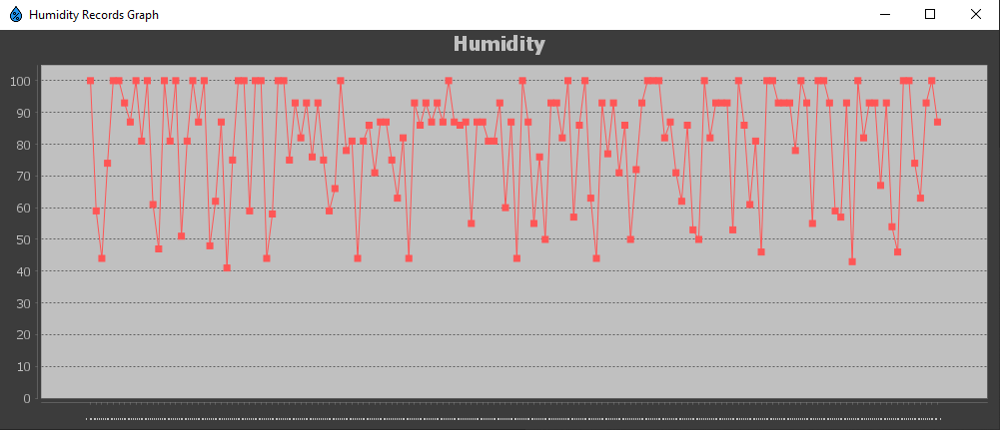

# You and me, Umidity! 

Umidity permette all' utente di selezionare diverse città per le quali visualizzare l' umidità corrente e, se desiderato, salvarne i dati periodicamente per generare poi statistiche.

### Overview
Umidity si presenta con due modalità di utilizzo:
1. il primo (funzionante) è tramite una interfaccia grafica;
2. il secondo (in via di sviluppo), tramite linea di comando.

#### Getting started: GUI
L' interfaccia è estremamente compatta e intuitiva.

Come prima cosa, inserire il nome di una città (per evitare ambiguità, è consigliato dire anche [stato](#state-code)
 o [codice postale](#zip-code) ) e premere "Search".
 **è possibile fare anche una ricerca per solo codice postale. In tal caso, sarà necessario indicare anche il codice di stato poiché Openweather utilizzerà il formato nord americano se non indicato diversamente!**
 
 

Sulla destra compariranno i risultati della ricerca che mostrano umidità e temperatura corrente, ma anche previsioni dei
prossimi 5 giorni, una ogni 3 ore.

A questo punto possiamo decidere d' inserire quest' ultima città nella lista delle "[città salvate](#saved-cities)" per le quali verranno
salvate localmente e periodicamente le informazioni meteo sulle quali, poi, si potranno calcolare [statistiche](#statistics) sul massimo, minimo,
media e varianza dell' umidità. Infatti, si potranno calcolare statistiche SOLO sulle città contrassegnate come "[città salvate](#saved-cities)".

Dopo aver salvato la città, il pannello delle statistiche si attiverà consentendo l' utente di visualizzare velocemente massimo, minimo, media e varianza d' umidità degli scorsi 7 giorni.
Il lasso di tempo è tuttavia personalizzabile:

* Dal menu a tendina si può selezionare "last 7 days" e "last 30 days" (ultimi 7/30 giorni).
* Oppure, "Custom range" (lasso di tempo personalizzato) che attiverà l' utilizzo dei selettori di data sottostanti.

è inoltre possibile visualizzare dei grafici riassuntivi delle statistiche mediante i bottoni "Simple graph" e "Record graph"

###### Simple graph
Permette di visualizzare massimo, minimo e media del lasso di tempo selezionato in maniera grafica.

###### Record graph
Permette di visualizzare l' andamento dell' umidità di tutti i record registrati.

#### Getting started: CLI
L' utilizzo di Umidity in versione cli è intesa per una consultazione rapida, dove la quantità di operazioni rimane limitata alla sessione in corso.
Infatti, nella versione corrente della CLI è possibile visualizzare solo i dati correnti e le previsioni di una città alla volta, senza la possibilità di salvarli nè di effettuare controlli periodici.
I dati non vengono dunque archiviati ma solo visualizzati al momento e poi cancellati.

All' avvio la cli presenta subito le operazioni disponibili:
1. Attuale
2. Previsioni
3. Passaggio a gui (Richiede riavvio)
4. Chiudi

Le richieste avvengono sempre ricercando per città, ed è svolto in tre passaggi:
1. (Richiesto) Inserimento città
2. (Opzionale) Inserimento [codice postale](#zip-code)
3. (Opzionale) Inserimento [codice stato](#state-code)

**Nei campi opzionali è sufficiente premere invio per andare avanti, tuttavia, se si inseriscono dati non corretti è probabile che non si visualizzeranno le informazioni corrette**

# Project
Il programma nasce come progetto d'esame, perciò il nostro obiettivo è stato quello di soddisfare tutte le richieste finendo, poi, per implementare anche funzioni aggiuntive.
La consegna prevede, in origine, che il programma implementi un servizio meteo dove, data una città, permetta di visualizzare l'umidità attuale e archiviare il dato periodicamente (una volta all'ora) per permettere il calcolo di alcune semplici statistiche con la possibilità di selezionare su quale periodo calcolarle.
Alla consegna originale, abbiamo aggiunto anche la possibilità di fare richieste per le previsioni dei prossimi 5 giorni e richieste dei 5 giorni precedenti, oltre che visualizzare anche la temperatura.

I dati riguardanti l'umidità sono ottenuti attraverso le API di OpenWeather e poi salvati come oggetti JSON su un "[database](#database)" (ovvero una directory sul file system).

## Diagrams and Designing

### Use case diagram

### Class diagram

### Sequence diagram

### Some ideas
[lista di idee scritte in progettazione coon spunta su quelle implementate]

## Source documentation
Scrivere una documentazione dettagliata del codice sorgente occuperebbe troppo spazio in un semplice file README.md come questo (per una documentazione dettagliata andare al seguente [link](doc) ), perciò di seguito vederemo solo le parti che consideriamo di notevole importanza:

### API

### GUI
La GUI è stata sviluppata utilizzando Java Swing. I componenti utilizzati provengono dalla libreria Swing,
ad eccezione di quelli utilizzati per la selezione delle date [LIB. jDatePicker](##Dependencies),
e di quelli utilizzati per la creazioni di grafici [LIB. jFree, LINK ALLE DEPENDENCIES SOTTO].

[MOSTRA JDATEPICKER][MOSTRA GRAFICI]

E' stata utilizzata una libreria esterna anche per la personalizzazione del tema dell'interfaccia.
[LIB. FlatLaf, LINK ALLE DEPENDENCIES SOTTO]

[MOSTRA LIGHT][MOSTRA DARK][GIF CAMBIAMENTO DA SETTINGS?]

Per l'aggiornamento sincrono delle città salvate è stata implementata un'interfaccia, utilizzata per lanciare
degli eventi che aggiornassero lo stato della City List su entrambi i Frame, qualora ci siano cambiamenti.

[GIF MAIN+SETTINGS AGGIORNAMENTO CITTA'???]

#### Area Selection

Nota Bene: lo stato va indicato tramite lo "State Code"

### CLI
### Database Manager
Il Database Manager si occupa di salvare su file, come oggetti JSON, le impostazioni e la lista delle città salvate 
con relativi dati acquisiti. 
Per riuscirci ci siamo serviti della classe ObjectMapper della [LIB. Jackson, LINK DEPENDENCIES]
usufruendo dei metodi writeValue e readValue, che permettono rispettivamente di serializzare e deserializzare gli oggetti.

Nel processo sono state create 3 classi, i cui attributi vengono serializzati se contraddistinti dal tag @JsonProperties:
* HumidityRecord: contiene le informazioni fondamentali sul singolo record sull'umidità, raggruppati poi su file divisi per città
* CityRecord: identifica una città di cui l'utente ha deciso di salvare i record, da aggiungere poi nel files cities.json [vedi come dirlo bene]
* UserSettings: classe usata come contenitore delle impostazioni scelte dall'utente, deserializzata nel file config.json

[MOSTRA CODICE SERIALIZZAZIONE/DESERIALLIZZAZIONE]
[MOSTRA IL CONTENUTO DI TUTTI I FILE]

### Statistics
## Tests
# Resources
## Software
## Dependencies

* Jackson: utilizzata per la gestione dei JSON ([vedi repository](https://github.com/FasterXML/jackson-docs))
* JFreeChart: utilizzata per la creazione dei grafici ([vedi repistory](https://github.com/jfree/jfreechart))
* jDatePicker: aggiunge componenti da implementare nella GUI per la selezione delle date([vedi repository](https://github.com/JDatePicker/JDatePicker))
* FlatLaf: aggiunge diversi SystemLookAndFeel, utilizzati per l'aspetto della GUI ([vedi repository](https://github.com/JFormDesigner/FlatLaf))
* JUnit 5: utilizzata per il testing ([vedi repository](https://github.com/junit-team/junit5))

# Contributors

Name | Email | GitHub | Contributing | LinkedIn 
--- | --- | --- | --- |--- 
Began Bajrami | <beganbajrami@outlook.it> |  [begbaj](https://github.com/begbaj) /  [dyrem](https://github.com/dyremm)| 
1/2
 | https://www.linkedin.com/in/begbaj/ 
Rahmi El Mechri | <rahmmi.elmechri@gmail.com>|  [OT-Rax](https://github.com/OT-Rax) | 
1/2
|https://www.linkedin.com/in/rahmi-el-mechri-7891701a1

# Disclaimer
Umidity è un programma sviluppato ai fini del progetto d'esame del corso di "Programmazione ad Oggetti" A/A 2020-2021 al
Università Politecnica delle Marche, non lo si deve considerare come un programma commerciale e pertanto non garantisce
il suo corretto funzionamento. L'utilizzo di Umidity è a rischio e pericolo dell'utente.
