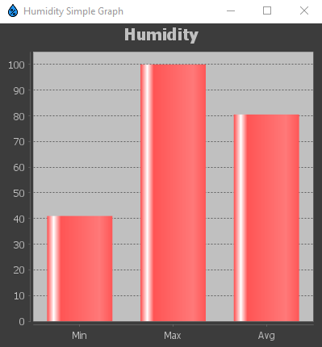
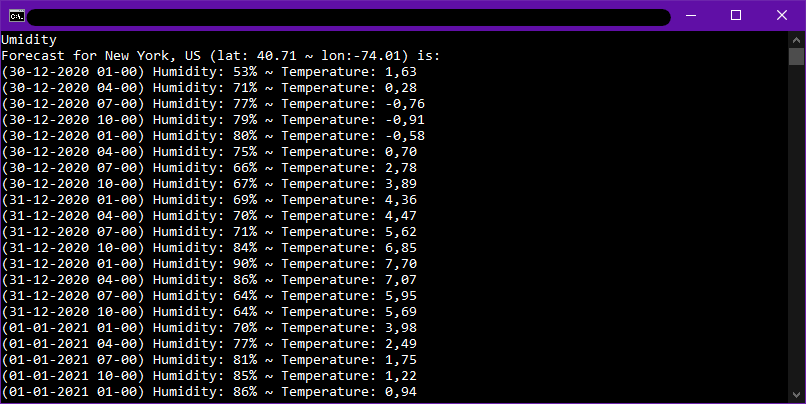

# You and me, Umidity! 

Umidity permette all'utente di selezionare diverse città per le quali visualizzare l'umidità corrente e, se desiderato,
salvarne i dati periodicamente per generare poi statistiche.


## Overview
Umidity si presenta con due modalità di utilizzo:
1. il primo (funzionante) è tramite una interfaccia grafica;
2. il secondo (in via di sviluppo), tramite linea di comando.


## Getting started: GUI
L'interfaccia è estremamente compatta e intuitiva.


Come prima cosa, inserire il nome di una città (per evitare ambiguità, è consigliato dire anche [stato](https://en.wikipedia.org/wiki/ISO_3166-2#Current_codes)
 o [codice postale](https://en.wikipedia.org/wiki/List_of_postal_codes) ) e premere "Search".
 **è possibile fare anche una ricerca per solo codice postale. In tal caso, sarà necessario indicare anche il codice di
 stato poiché Openweather utilizzerà il formato nord americano se non indicato diversamente!**
 
 


Sulla destra compariranno i risultati della ricerca che mostrano umidità e temperatura corrente, ma anche previsioni dei
prossimi 5 giorni, una ogni 3 ore.


A questo punto possiamo decidere d'inserire quest'ultima città nella lista delle "[città salvate](#saved-cities)"
per le quali verranno salvate localmente e periodicamente le informazioni meteo sulle quali, poi, si potranno calcolare
[statistiche](#statistics) sul massimo, minimo,media e varianza dell'umidità. Infatti, si potranno calcolare statistiche
SOLO sulle città contrassegnate come "[città salvate](#saved-cities)".


Dopo aver salvato la città, il pannello delle statistiche si attiverà consentendo l'utente di visualizzare velocemente
massimo, minimo, media e varianza d'umidità degli scorsi 7 giorni.

Il lasso di tempo è tuttavia personalizzabile:

* Dal menu a tendina si può selezionare "last 7 days" e "last 30 days" (ultimi 7/30 giorni).
* Oppure, "Custom range" (lasso di tempo personalizzato) che attiverà l'utilizzo dei selettori di data sottostanti.


è inoltre possibile visualizzare dei grafici riassuntivi delle statistiche mediante i bottoni "Simple graph" e "Record graph":

#### Simple graph
Permette di visualizzare massimo, minimo e media del lasso di tempo selezionato in maniera grafica.




#### Record graph
Permette di visualizzare l'andamento dell'umidità di tutti i record registrati.


## Getting started: CLI
L'utilizzo di Umidity in versione cli è intesa per una consultazione rapida, dove la quantità di operazioni rimane
limitata alla sessione in corso.

Infatti, nella versione corrente della CLI è possibile visualizzare solo i dati correnti e le previsioni di una città
alla volta, senza la possibilità di salvarli nè di effettuare controlli periodici.

I dati non vengono dunque archiviati ma solo visualizzati al momento e poi cancellati.


All'avvio la cli presenta subito le operazioni disponibili:
1. Attuale
2. Previsioni
3. Passaggio a gui (Richiede riavvio)
4. Chiudi

Le richieste avvengono sempre ricercando per città, ed è svolto in tre passaggi:
1. (Richiesto) Inserimento città
2. (Opzionale) Inserimento [codice postale](#zip-code)
3. (Opzionale) Inserimento [codice stato](#state-code)

**Nei campi opzionali è sufficiente premere invio per andare avanti, tuttavia, se si inseriscono dati non corretti è
probabile che non si visualizzeranno le informazioni corrette**





# Project
Il programma nasce come progetto d'esame, perciò il nostro obiettivo è stato quello di soddisfare tutte le richieste
finendo, poi, per implementare anche funzioni aggiuntive.

La consegna prevede, in origine, che il programma implementi un servizio meteo dove, data una città, permetta di
visualizzare l'umidità attuale e archiviare il dato periodicamente (una volta all'ora) per permettere il calcolo di
alcune semplici statistiche con la possibilità di selezionare su quale periodo calcolarle.

Alla consegna originale, abbiamo aggiunto anche la possibilità di fare richieste per le previsioni dei prossimi 5 giorni
e richieste dei 5 giorni precedenti, oltre che visualizzare anche la temperatura.

I dati riguardanti l'umidità sono ottenuti attraverso le API di OpenWeather e poi salvati come oggetti JSON su un 
"[database](#database)" (ovvero una directory sul file system).

## Diagrams and Designing
I seguenti diagrammi sono stati disegnati in fase di progettazione, per tanto non rispecchiano esattamente la situazione attuale di Umidity. Ci sembra comunque importante notare
quanto risulti utile, sopratutto se si lavora in compagnia, utilizzare questa tipologia di schemi per rendere chiaro a tutti i membri del gruppo quali siano le idee e come si ha intenzione di realizzarle.

### Use case diagram ([ingrandisci](img/usecase_diagram.png))


**Nota:** Lo _"Use case diagram"_ è volutamente semplice perchè in fase di progettazione ci sembrava poco producente complicare tale schema poichè eravamo consapevoli dei possibili numerosi cambiamenti che si sarebbero susseguiti. Tuttavia, a differenza degli altri due diagrammi, lo _"Use case"_ sembra essere rimasto realmente l'unico a non aver subito cambiamenti dall'inizio alla fine del progetto, proprio per la sua semplicità e capacità di generalizzare al massimo i casi d'uso di Umidity.


### Class diagram ([ingrandisci](img/class_diagram.png))


**Nota:** Il _"Class Diagram"_ mostra la struttura alla base del nostro progetto. Sono numerose le modifiche effettuate, nonostante ciò, il diagramma rimane
comunque fedele al programma, anche nella sua forma finale. 


### Sequence diagram ([ingrandisci](img/sequence_diagram.png))


**Nota:** Il _"Sequence Diagram"_ definisce le interazione che sin dall'inizio del progetto abbiamo immaginato potessero esserci. 
Nonostante non abbia subito notevoli cambiamenti, è possibile comunque notare delle differenze col progetto finale.


### Some ideas
- [x] Forecasting
- [x] Tema GUI
- [x] Città preferita all'avvio
- [x] Implementazione System Tray
- [x] API Key impostabile
- [x] Easter Eggs
- [ ] Limite Dimensione File
- [ ] Cambio unità di misura

## Source documentation
Scrivere una documentazione dettagliata del codice sorgente occuperebbe troppo spazio in un semplice file README.md
come questo (per una documentazione dettagliata andare al seguente [link](docs)), perciò di seguito vedremo solo le
parti che consideriamo di notevole importanza.

**è importante sottolineare che il codice è stato pensato in maniera "modulare", ovvero che ogni package che fa parte
del "motore" (api e database per intenderci, ma anche cli.frames) di Umidity è in realtà un package facilmente esportabile e funzionante
senza la necessità del resto del codice(fatta eccezione per alcune dipendenze come Jackson)**


### API
Il package API contiene tutte le classi essenziali per effettuare le chiamate alle API offerte da OpenWeather su piano
gratuito. Le chiamate vengono effettuate dalla classe ApiCaller che permette di effettuare tutte le chiamate possibili
(fatta eccezione per alcune api che non sarebbero mai risultate utili ai fini di Umidity, ovvero: "Get in rectangle" e
"Get in circle" delle API sulla current weather).

#### Async Caller
AsyncCaller è una classe che estende Thread (da cui il nome "AsyncCaller") che permette di effettuare singole o
periodiche chiamate alle API in maniera asincrona. Per effettuare le chiamate, AsyncCaller crea un ApiCaller.
Una alternativa a questo metodo è quella di estendere ApiCaller in AsyncCaller, ma cosi facendo non potremmo poi farlo
con la classe Thread, poiché Java non permette la multipla ereditarietà (una alternativa valida sarebbe stata quella di
estendere ApiCaller e d'implementare Runnable).

Essendo AsyncCaller un processo avviato in un thread a parte, non è possibile avere un valore di ritorno dalle chiamate
in maniera diretta, per questo motivo abbiamo utilizzato una gestione di eventi personalizzata (di seguito, il contenuto
dell'interfaccia "ApiListener"):

```java
    public interface ApiListener {
        void onReceiveCurrent(Object sender, ApiArgument arg);
        void onReceiveForecast(Object sender, ApiArgument arg);
        void onReceiveHistorical(Object sender, ApiArgument arg);
        void onReceive(Object sender, ApiArgument arg);
        void onRequestCurrent(Object sender, ApiArgument arg);
        void onRequestForecast(Object sender, ApiArgument arg);
        void onRequestHistorical(Object sender, ApiArgument arg);
        void onRequest(Object sender, ApiArgument arg);
        void onException(Object sender, Exception e);
    }
```
ApiListener contiene dunque una definizione dei metodi che possono essere richiamati.

Tale interfaccia andrà poi implementata alle classi che dovranno effettivamente gestire tali eventi.

Gli eventi vengono lanciati da ApiCaller a seconda di quando sia giusto lanciarne uno oppure l'altro.

Esempio metodo ApiCaller:

```java
public class ApiCaller extends Caller {
        [...]
        public ApiCaller getByCityName(String cityName, String stateCode, String countryCode) throws IOException {
            for(ApiListener l:apiListeners){
                l.onRequest(this, null);
                l.onRequestCurrent(this, null);
            }
        
            String url = "https://api.openweathermap.org/data/2.5/weather?q="
                    + cityName
                    + (!stateCode.equals("") ? "," + stateCode : "")
                    + (!countryCode.equals("") ? "," + countryCode : "")
                    + endParams;
        
            ApiResponse response = new ObjectMapper().readerFor(ApiResponse.class).readValue(new URL(url));
            ApiArgument apiArg = new ApiArgument(response.getSingles());
            for(ApiListener l:apiListeners){
                l.onReceiveCurrent(this, apiArg);
                l.onReceive(this, apiArg);
            }
            return response;
        }
        [...]
}
```

Come posiamo notare, il metodo fa una chiamata al evento da lanciare per ogni classe aggiunta ai "listeners".
In questa maniera possiamo dunque ottenere periodicamente aggiornamenti da AsyncCaller.

### GUI


#### Components
La GUI è stata sviluppata utilizzando Java Swing. I componenti utilizzati provengono dalla libreria Swing,
ad eccezione di quelli utilizzati per la selezione delle date ([jDatePicker](#Dependencies)),
e di quelli utilizzati per la creazioni dei grafici già mostrati sopra([jFreeChart](#Dependencies)).

* JDatePicker


#### Themes
E'stata utilizzata una libreria esterna anche per la personalizzazione del tema dell'interfaccia.
([FlatLaf](#Dependencies))


#### Synchronization
Per l'aggiornamento sincrono delle città salvate è stata implementata un'interfaccia, utilizzata per lanciare
degli eventi che aggiornino lo stato della City List su entrambi i Frame, qualora ci siano cambiamenti.

* Evento nel Frame principale
```java
    public void onChangedCities() {
            if(!Main.dbms.cityIsSaved(realtimeResponse.getCityId()))
            {
                listenerOn=false;
                saveCityRecordsCheckBox.setSelected(false);
                setPanelEnabled(statisticPanel, false);
                nosuchLabel.setText("City removed!");
                updateTable(statisticsTable, null, statisticsColumnNames);
                listenerOn=true;
            }
            updateAsynCaller();
    }
```

* Evento nel Frame delle impostazioni
```java
public void onChangedCities() {
            createCityTable();
    }
```

* Esempio


#### System Tray
Data la natura del programma, è necessario che il processo rimanga aperto per poter raccogliere più dati possibili.
Per questa ragione, abbiamo deciso di implementare la minimizzazione del programma, accessibile poi dal System Tray,
affinché questi non venga chiuso.


### CLI
La CLI (Command Line Interface) è partita con l'idea di sviluppare un framework per sviluppare interfacce a linea di comando
basandosi sul concetto di form. Il progetto però, poiché andava troppo oltre le richieste della consegna originale, è stato
poi sospeso in quanto richiedeva molto tempo di progettazione e di implementazione. Tuttavia, siamo riusciti ad avere una
"prima versione" funzionante.

Il progetto si basa sul gestire le varie sezioni da visualizzare nella linea di comando tramite dei Frame, che a loro volta
contengono i Form (moduli). I Frame vengono trattati come contenitori di Form, ma il vero protagonista è il FrameManager:
esso infatti gestisce tutto cio che riguarda la visualizzazione dei form e l'interfacciamento con l'utente tramite la
gestione del input, oltre che essere anche lui un contenitore di frame.

Esempio di struttura:
```text
    FrameManager :
    [
        FrameMainMenu:
        [
            TitleForm,
            MessageForm,
            InputForm
        ],
        FrameSettings:
        [
            TitleForm,
            MessageForm,
            InputForm
        ],
        ...
    ]
```

Per fare ciò, il FrameManager esegue ciclicamente una serie di metodi che aggiornano la visuale del utente:

```java
public class FrameManager {
    [...]
    public void refresh() {
        if(!inited) init();
        beforeUpdate();
        update();
        afterUpdate();
    }
    [...]
}
```
Le fasi del refresh:

0. Se questa è la prima iterazione, il FrameManager esegue una serie d'istruzioni presenti nel `init()` per non eseguirle
poi nuovamente nelle iterazioni successive
1. `beforeUpdate()`: istruzioni da eseguire prima del aggiornamento della schermata
2. `update()`: istruzioni da eseguire durante l'aggiornamento della schermata
3. `afterUpdate()`: istruzioni da eseguire in seguito all'aggiornamento della schermata (solitamente operazioni d'input)

Dopo la prima iterazione, i passaggio 1,2 e 3 verranno eseguiti ciclicamente.

Seppur ancora in fase di sviluppo e sicuramente nemmeno lontanamente vicino alla sua forma finale, il package contenente
tutto il sistema di "Frame Management" è **esportabile in un qualsiasi progetto Java** poichè il codice non è dipendente
dal resto del programma (caratteristica rispettata anche in altre parti del codice di Umidity).

### Database Manager
Il Database Manager si occupa di salvare su file, come oggetti JSON, le impostazioni e la lista delle città salvate 
con relativi dati acquisiti. 
Per riuscirci ci siamo serviti della classe ObjectMapper della libreria [Jackson](#Dependencies)
usufruendo dei metodi writeValue e readValue, che permettono rispettivamente di serializzare e deserializzare gli oggetti.

Nel processo sono state create 3 classi, i cui attributi vengono serializzati se contraddistinti dal tag @JsonProperties:
* HumidityRecord: contiene le informazioni fondamentali sul singolo record sull'umidità, raggruppati poi su file divisi per città
  * Esempio records 
```JSON
[ {
"humidity" : 44.0,
"timestamp" : 1609349610,
"city" : {
"id" : 5128581,
"name" : "New York",
"coord" : {
"lat" : 40.71,
"lon" : -74.01
}
}
}, {
"humidity" : 64.0,
"timestamp" : 1609344227,
"city" : {
"id" : 5128581,
"name" : "New York",
"coord" : {
"lat" : 40.71,
"lon" : -74.01
}
}
} ]
```
<a name="saved-cities"><a/>
* CityRecord: identifica una città, se l'utente decide di salvarsi i record della città, essa verrà serializzata e aggiunta al file cities.json.
  Una solo città può inoltre essere impostata come preferita, e quindi serializzata e salvata nel file favourite.json.
  * Esempio cities.json
```JSON
[ {
  "id" : 5128581,
  "name" : "New York",
  "coord" : {
    "lat" : 40.71,
    "lon" : -74.01
  }
}, {
  "id" : 4164138,
  "name" : "Miami",
  "coord" : {
    "lat" : 25.77,
    "lon" : -80.19
  }
}, {
  "id" : 5368361,
  "name" : "Los Angeles",
  "coord" : {
    "lat" : 34.05,
    "lon" : -118.24
  }
}, {
  "id" : 4930956,
  "name" : "Boston",
  "coord" : {
    "lat" : 42.36,
    "lon" : -71.06
  }
} ]
```
  * Esempio favourite.json
```JSON
    {
    "id" : 3183087,
    "name" : "Provincia di Ancona",
    "coord" : {
    "lat" : 43.55,
    "lon" : 13.17
    }
    }
```

* UserSettings: classe usata come contenitore delle impostazioni scelte dall'utente, serializzata nel file config.json
  * Esempio config.json
 ```JSON
{
"gui" : true,
"gui_theme" : "Light",
"api_key" : "b1b15e88fa797225412429c1c50c122a1"
}
```

# Resources
## Software
* IntelliJ IDEA: IDE utilizzato per lo sviluppo del codice
* Star UML: software di progettazione dei diagrammi UML
* Postman: strumento utile per testare le chiamate alle API
* OpenWeather API: tutte le informazioni riguardanti l'umidità e il meteo vengono prese da OpenWeather

## Dependencies
Tutte le dipendenze sono state gestite con Maven:


* Jackson: utilizzata per la gestione dei JSON ([vedi repository](https://github.com/FasterXML/jackson-docs))
* JFreeChart: utilizzata per la creazione dei grafici ([vedi repistory](https://github.com/jfree/jfreechart))
* jDatePicker: aggiunge componenti da implementare nella GUI per la selezione delle date([vedi repository](https://github.com/JDatePicker/JDatePicker))
* FlatLaf: aggiunge diversi SystemLookAndFeel, utilizzati per l'aspetto della GUI ([vedi repository](https://github.com/JFormDesigner/FlatLaf))
* JUnit 5: utilizzata per il testing ([vedi repository](https://github.com/junit-team/junit5))

# Contributors

Name | Email | GitHub | Contributing | LinkedIn 
--- | --- | --- | --- |--- 
Began Bajrami | <beganbajrami@outlook.it> |  [begbaj](https://github.com/begbaj) /  [dyrem](https://github.com/dyremm)| <p align="center">1/2<p align="center"> | https://www.linkedin.com/in/begbaj/ 
Rahmi El Mechri | <rahmmi.elmechri@gmail.com>|  [OT-Rax](https://github.com/OT-Rax) | <p align="center">1/2<p align="center">|https://www.linkedin.com/in/rahmi-elmechri/

# Disclaimer
Umidity è un programma sviluppato ai fini del progetto d'esame del corso di "Programmazione ad Oggetti" A/A 2020-2021 all'
Università Politecnica delle Marche, non lo si deve considerare come un programma commerciale e pertanto non garantisce
il suo corretto funzionamento. L'utilizzo di Umidity è a rischio e pericolo dell'utente.
